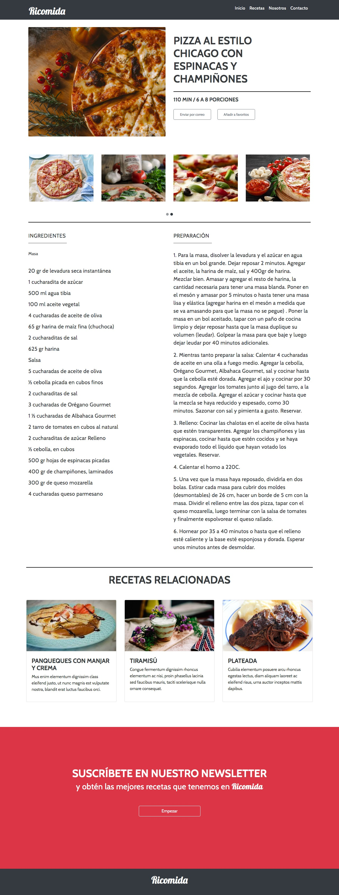

# Desafío - Ricomida
> Aplicando todos los conceptos y herramientas aprendidas en la sesión online, construiremos el
sitio web de "Ricomida".



## Requisitos

- Construir un layout responsivo (Bootstrap - Mobile First)
- Realizar la construcción del HTML y CSS siguiendo la guía de estilo proporcionada.
- Aprovecha la grilla de Bootstrap.
- Añade un carousel de imágenes al proyecto (como se ve en la maqueta).
- Añade Tooltips en los botones de la página.

Tipografías:
- Cabin
- Lobster 

font-weight:
- Cabin Regular (400)
- Cabin Bold (700).
- Lobster Regular (400).

Colores:
- #373a3C
- #dddddd
- #000 o var(--black)
- #fff o var(--white);
- #dc3545 o var(--danger);


```sh
/assets/img para las imágenes
/assets/css/style.css para el archivo CSS
/assets/js/script.js para el archivo JavaScript
/index.html
```
